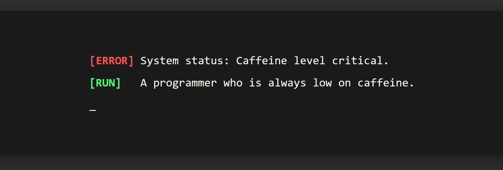

  <!-- Replace banner.png with your actual image file name -->
  

 

### 👋 About Me
A programmer, wanna-be engineer, and always low on caffeine. Currently leveling up my Java development skills and learning how to piece together robust systems from the ground up.

📫 **Let's connect:** [underflowcoffee@gmail.com](mailto:hello.coffeeunderflow@gmail.com)
